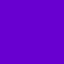
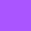

| Name        | RGB (Hex) | RGB (Dec)         | HSL                    | CMYK                      | Preview                                                                             |
|-------------|-----------|-------------------|------------------------|---------------------------|:-----------------------------------------------------------------------------------:|
| **Primary** | `#6800D0` | `104`   `0` `208` | `270deg` `100%`  `41%` | `59%` `100%` `18%`  `18%` |  |
| **Accent**  | `#AA55FF` | `170`  `85` `255` | `270deg` `100%`  `67%` | `33%`  `67%`  `0%`   `0%` |   |
| **Light**   | `#D3C8DD` | `211` `200` `221` | `271deg`  `24%` ` 83%` | `17%`  `22%` `13%`  `13%` |    |
| **Text**    | `#000000` |   `0`   `0`   `0` |   `0deg`   `0%`   `0%` |  `0%`   `0%`  `0%` `100%` |     |
| **White**   | `#FFFFFF` | `255` `255` `255` |   `0deg`   `0%` `100%` |  `0%`   `0%`  `0%`   `0%` |    |
